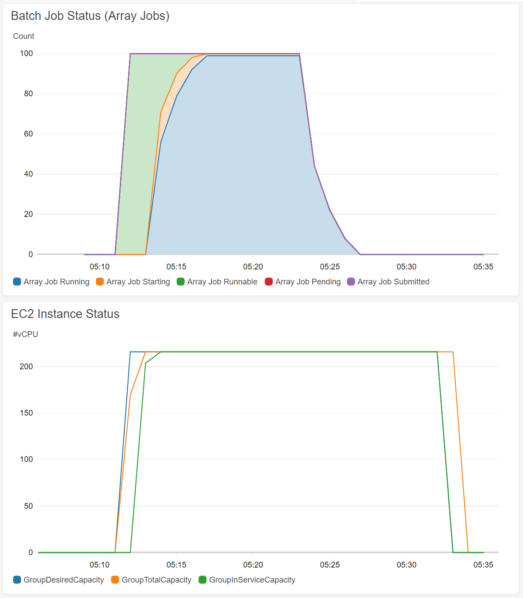

# aws-batch-job-monitor

Monitoring AWS Batch job status and send to CloudWatch

## Usage

[](https://console.aws.amazon.com/cloudformation/home?#/stacks/new?stackName=JobMonitor&templateURL=https://midaisuk-public-templates.s3.amazonaws.com/aws-batch-job-monitor/aws-batch-job-monitor-build.template
)

or with CLI

```bash
$ aws cloudformation create-stack --stack-name JobMonitor --template-url https://midaisuk-public-templates.s3.amazonaws.com/aws-batch-job-monitor/aws-batch-job-monitor-build.template --capabilities CAPABILITY_NAMED_IAM
```

## Collected Metrics from AWS Batch

- **Job**: number of jobs in each status(1) in each queue
- **Job vCPUs**: total amount of requested vCPUs in each status(1) in each queue
- **Job Memory**: total amount of requested memory in each status(1) in each queue
- **Array Job**: total number of array job size in each status(1) in each queue
- **Array Job vCPUs**: total amount of requested vCPUs from array job in each status(1) in each queue
- **Array Job Memory**: total amount of requested Memory from array job in each status(1) in each queue

(1): job status in `SUBMITTED`, `PENDING`, `RUNNABLE`, `STARTING`, `RUNNING` are collected. `SUCCEEDED`, `FAILED` are not collected by default.


## Note

### Scale-out/in information of EC2 instance launched from AWS Batch

You can collect information of number of instance by enabling **Auto Scaling Group group metrics**. 
Please note that Auto Scaling Group for the each compute environment is created after first job was submitted.
More information, see: https://docs.aws.amazon.com/ja_jp/autoscaling/ec2/userguide/as-instance-monitoring.html#as-enable-group-metrics


## Screen Shots



(2): Instance pacacity on This dashboard is using Auto Scaling Group group metrics. Please see the Note below.

## TODO

- support multi node job
- counting GPU requests


