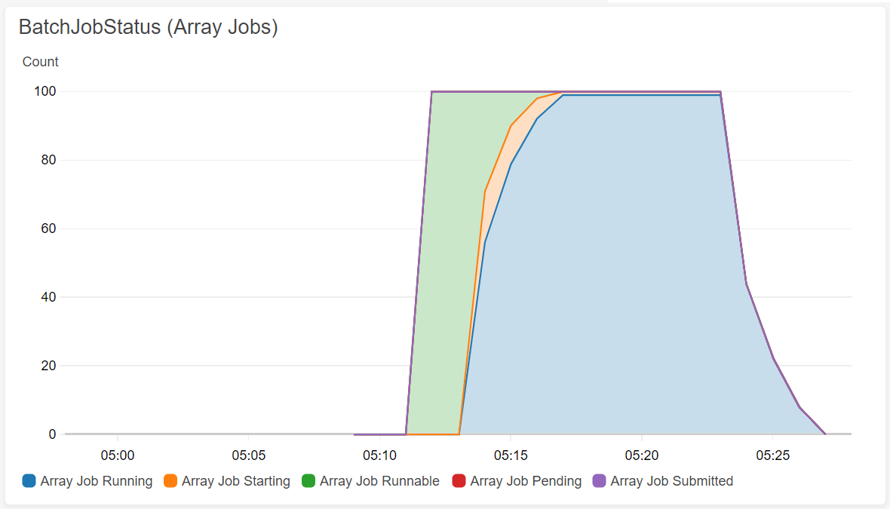

# aws-batch-job-monitor

Monitoring AWS Batch job status and send to CloudWatch




## Usage

[](https://console.aws.amazon.com/cloudformation/home?#/stacks/new?stackName=JobMonitor&templateURL=https://midaisuk-public-templates.s3.amazonaws.com/aws-batch-job-monitor/aws-batch-job-monitor.template
)

or with CLI

```bash
$ aws cloudformation create-stack --stack-name JobMonitor --template-url https://midaisuk-public-templates.s3.amazonaws.com/aws-batch-job-monitor/aws-batch-job-monitor.template --capabilities CAPABILITY_NAMED_IAM
```


## TODO

- support multi node job
- counting GPU requests


